## 🎬 CineTV – Flutter + Supabase Tabanlı Film & Dizi Platformu

CineTV, modern streaming deneyimini mobil dünyaya taşıyan **Flutter + Supabase** tabanlı bir hibrit eğlence platformudur. Gerçek zamanlı veritabanı, kullanıcı oturumu, favoriler yönetimi, kişisel öneri algoritması ve gelişmiş arama filtresi gibi özelliklerle tam bir **Streaming Panel** olarak geliştirilmiştir.

> ⚠️ Bu proje **gerçek tam uzunlukta film/dizi oynatma içermez**. Streaming sağlayıcı API kısıtları nedeniyle, sadece fragmanlar, posterler, meta veriler ve izleme sağlayıcı yönlendirmeleri gösterilmektedir. **Gerçek yayın akışı için ayrı bir lisanslı backend çözümü ve içerik sağlayıcı entegrasyonu gereklidir.**

---

## 🚀 Özellikler

- 🔐 **Supabase Auth** ile e-posta tabanlı kullanıcı kaydı ve oturum yönetimi
- ❤️ Favori film & dizi ekleme, geri bildirimli snackbar yapısı
- 🔍 Gelişmiş filtreleme: Tür, yıl aralığı, arama metni
- ⭐ Kişiselleştirilmiş öneri algoritması (favorilere dayalı)
- 🎞 Fragman oynatma (YouTube, Vimeo, Dailymotion)
- 📡 TMDB API entegrasyonu ile gerçek zamanlı içerik meta verisi
- 🧩 MVVM + Clean Architecture yapısı
- 🌙 Minimal modelde theme desteği

---

## 🛢 Backend (Supabase) Mimari Özeti

CineTV'nin backend altyapısı **Supabase üzerinde PostgreSQL tabanlı** bir yapı ile tasarlanmıştır.

- `titles`, `videos`, `favorites`, `seasons`, `episodes` gibi tablolar ile tam ilişkisel yapı oluşturulmuştur
- `Row Level Security` aktif, kullanıcıya özel veri izolasyonu sağlanmıştır
- Trigger ve policy yapıları, otomatik veri tutarlılığı için devrededir

**Migration Komutları (Özetleyici Şekilde):**

```sql
-- titles tablosu oluşturma
create table titles (...);

-- favoriler ilişkisi
create table favorites (
  user_id uuid references auth.users(id),
  title_id int,
  created_at timestamp default now()
);

-- ========== 4) EPISODES ==========
create table if not exists public.episodes (

-- FAVORITES (movie+show tek tablo)
create table if not exists public.favorites (
```

> Tüm migration dosyaları Supabase üzerinde GUI ve SQL Editor aracılığıyla yönetilmiştir.

---

## 📁 Proje Mimarisi (MVVM + Clean)

```
lib/
 ├─ core/        → app constants, env, dio client
 ├─ data/        → repositories, datasources, models
 ├─ features/    → auth, search, detail, profile modülleri
 ├─ widgets/     → UI bileşenleri
 └─ main.dart    → Supabase init & App bootstrap
```

---

## 🖼 Uygulama Ekran Görüntüleri

## CineTv Banner

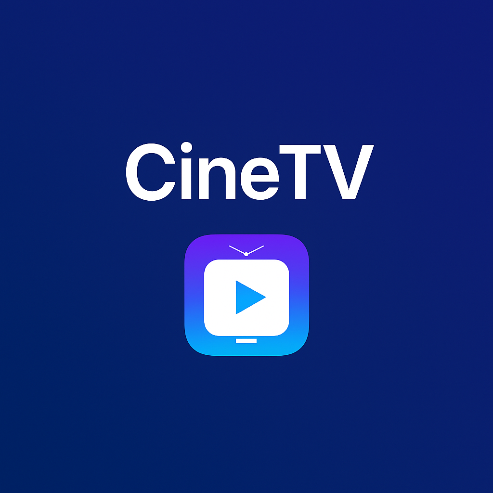

## Splash


## Login/Register

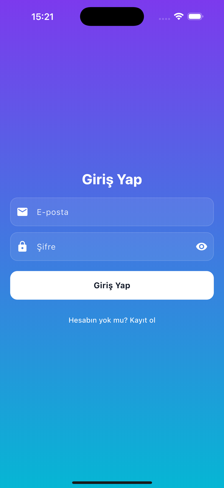

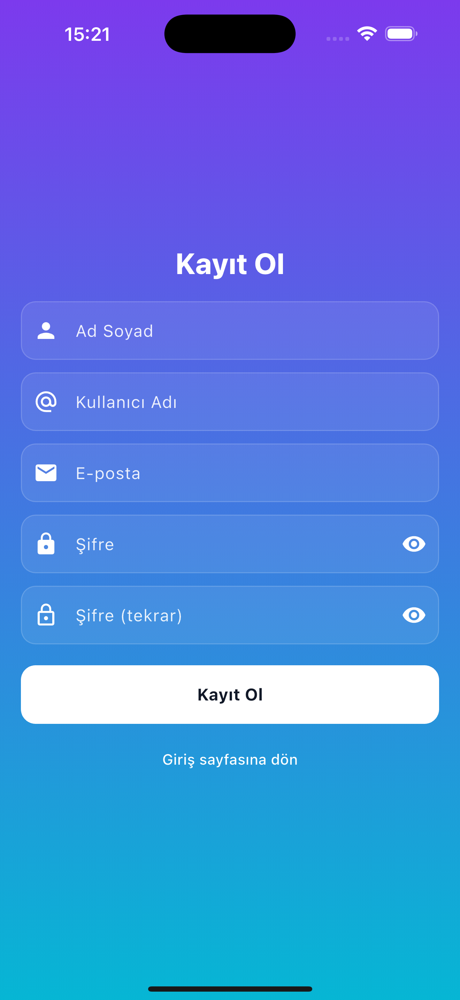
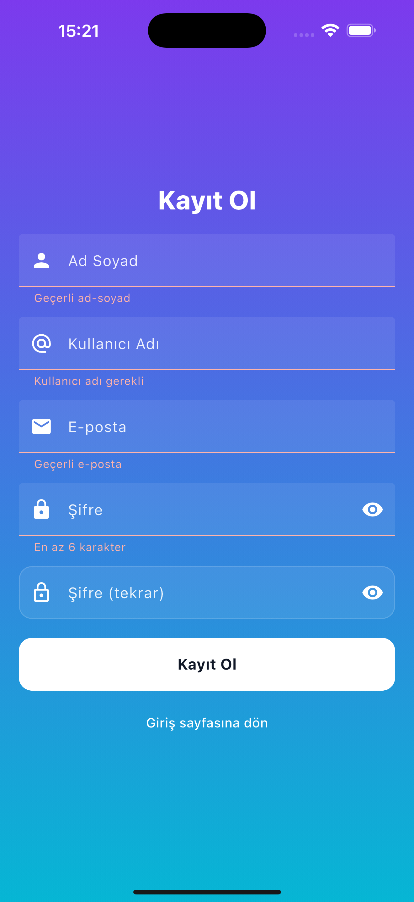

## Filmler

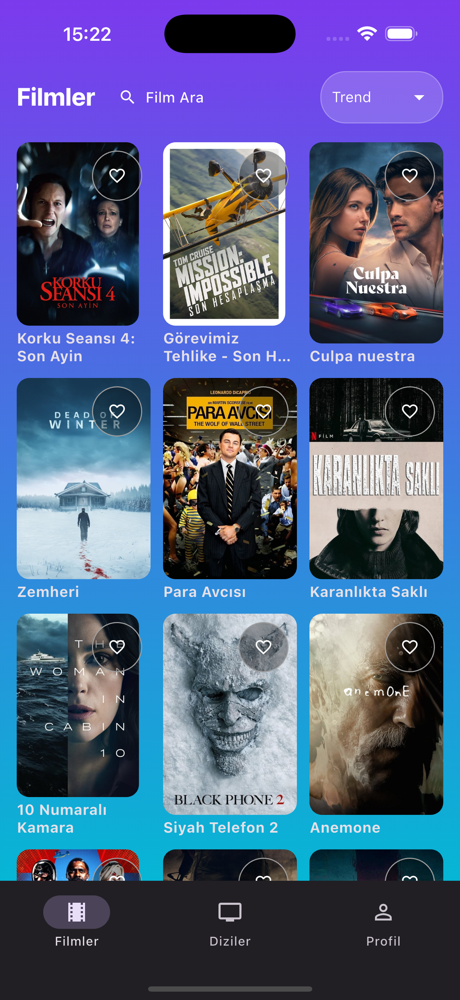
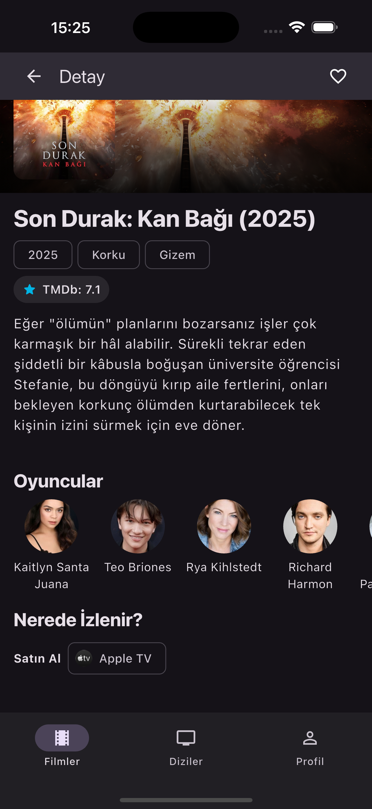
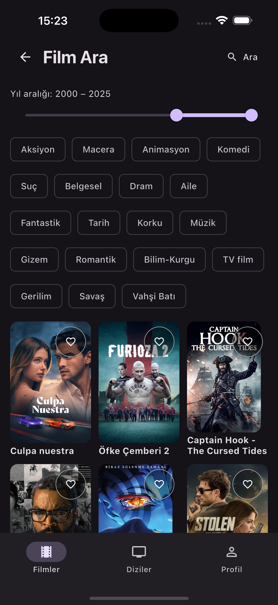

## Diziler


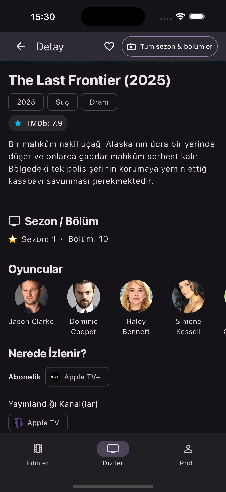
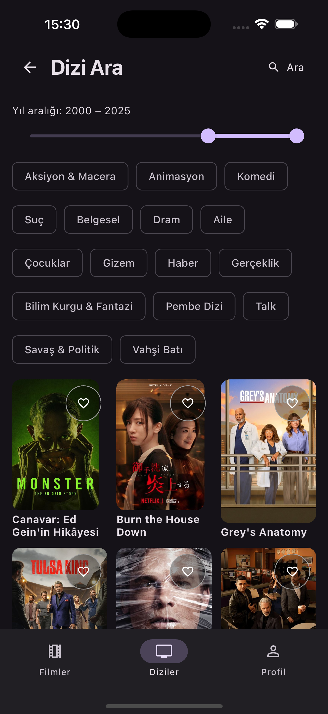

## Profil

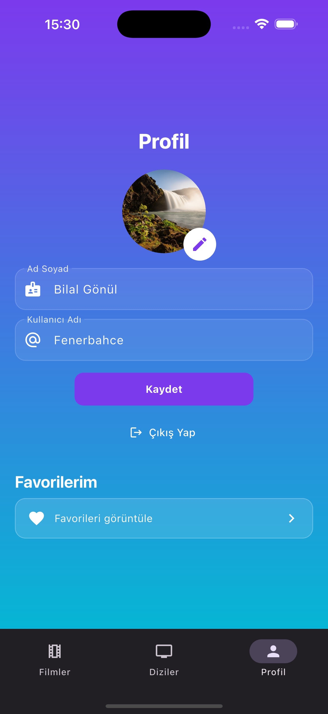
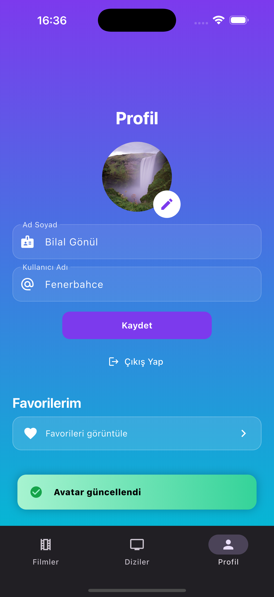

## Favori

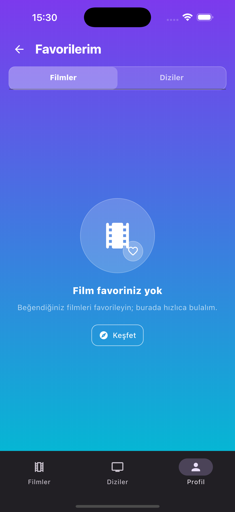
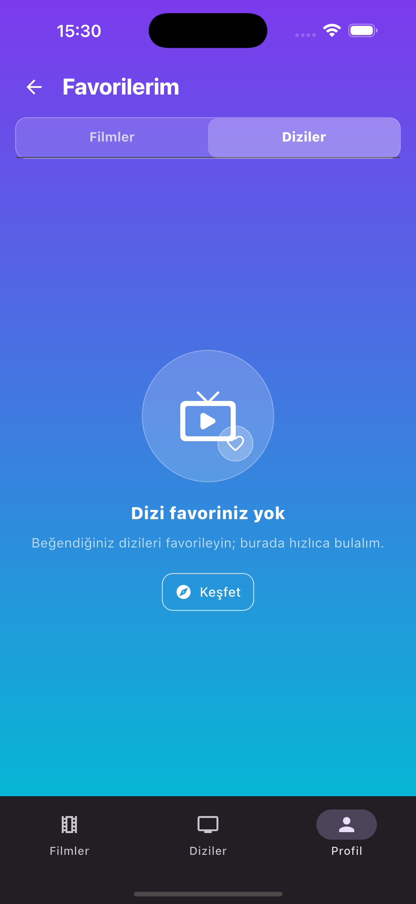
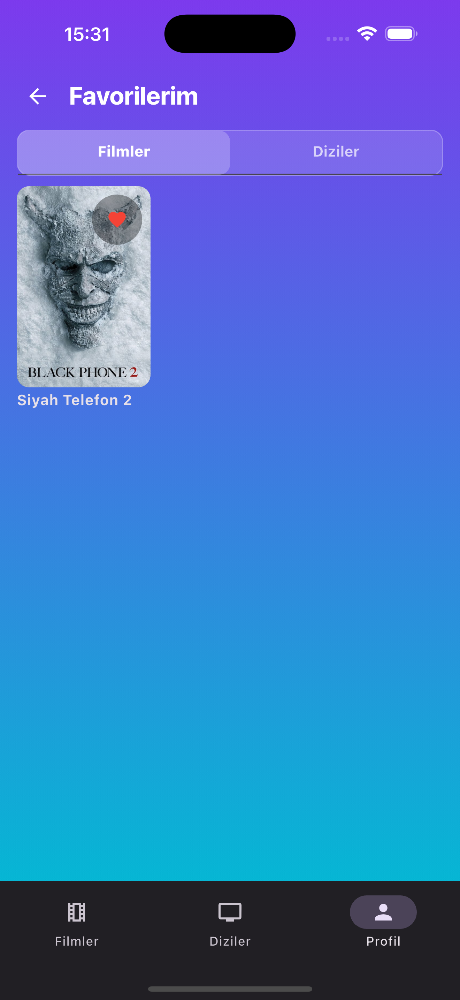
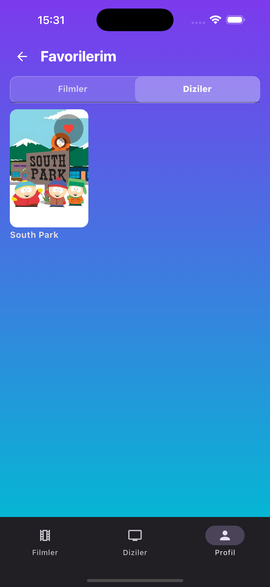

---

## 🧪 Teknik Altyapı

| Katman           | Teknoloji                    |
| ---------------- | ---------------------------- |
| Frontend         | Flutter (Dart)               |
| Backend          | Supabase (PostgreSQL + Auth) |
| State Management | Riverpod                     |
| API Provider     | Dio + TMDB API               |
| Local Storage    | SharedPreferences            |

---

## 💡 Geliştirici Notu

Bu proje, streaming uygulaması geliştirmek isteyenler için **gerçek dünyaya yakın bir mimari referans** niteliğindedir. API kısıtları sebebiyle gerçek içerik akışı mevcut değildir; ancak altyapı tam sürüme geçmeye uygundur.

> **Full içerik yayını için lisanslı kaynak, DRM korumalı media sunucusu ve özel backend entegrasyonu gereklidir.** **Proje Upgrade Edilerek Tam Sürüme Geçilebilir**

---

## 📄 Lisans

📌 **Bu proje MIT benzeri açık kaynak modelde paylaşılmaktadır ancak ticari amaçla izinsiz kullanılamaz.**
Kodların bütünlüğü korunmalı, yeniden dağıtım veya ticari platformda kullanımı için geliştirici izni alınmalıdır.

---

## 📬 İletişim

> Geri bildirim veya iş birliği için issue açabilir ya da pull request gönderebilirsin.

---

✨ **CineTV – Modern Flutter Streaming Deneyimi için Geliştirilebilir Tam Mimari**

## Kurulum Şeması

## ⚙️ Kurulum Adımları

1️⃣ Bağımlılıkları Yükle
flutter pub get

## Ortam Değişkenlerini Ayarla

cp .env.example .env

.env dosyasına kendi Supabase, TMDB ve diğer API anahtarlarını doldurun.
Her anahtar doğru formatta olmalıdır (tırnaksız, direkt değer).

## Supabase Projesini Bağla (isteğe bağlı, backend ile çalışmak isteyenler için)

supabase init
supabase link --project-ref <YOUR_PROJECT_REF>

## Veritabanı Şemasını Aktar

supabase db push

Bu komut, titles, favorites, videos, episodes gibi tabloları otomatik oluşturur.

## Projeyi Çalıştır

flutter run
